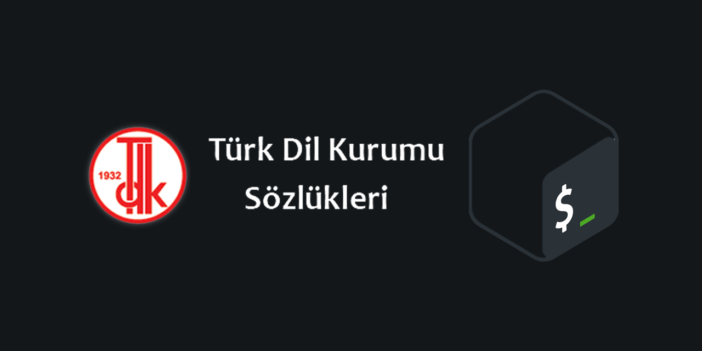

# Güncel Türkçe sözlük (GTS-CLI)

  

**Çevrimdışı erişim ve kullanıcı dostu komut satırı arayüzüyle donatılmış özgür bir Güncel Türkçe Sözlük (GTS) programı.**

[**Özgür yazılım nedir?**](https://tr.wikipedia.org/wiki/%C3%96zg%C3%BCr_yaz%C4%B1l%C4%B1m)

## Kurulum
[**Buradan**](https://github.com/sanalzio/TDK-GTS-CLI/releases) en güncel sürümü indirip kullanabilirsiniz.

## Kullanım

```bash
./gts <argümanlar> "<aranacak kelime>"
```

### Kullanım örnekleri

```
./gts --yardim
./gts -j "Güncel"
./gts "Türkçe"
./gts -oab "Sözlük"
```

## Argümanlar

- `-y, --yardim` Bu menüyü gösterir.
- `-j, --json` Json biçimindeki çıktıyı gösterir.
- `-o` eşer varsa anlamların örneklerini gösterir.
- `-a` eşer varsa kelime ile ilgili atasözlerini gösterir.
- `-b` eşer varsa kelime ile birleşik olan kelimeleri gösterir.

## Yardım menüsü

```

                   gts 1.0.0
    Komut satırı arayüzlü güncel Türkçe sözlük.

    Kullanımı: ./gts <argümanlar> "<aranacak kelime>"

  Argümanlar:

    -y, --yardim: Bu menüyü gösterir
    -j, --json: Json biçimindeki çıktıyı gösterir.
    -o: eğer varsa anlamların örneklerini gösterir.
    -a: eğer varsa kelime ile ilgili atasözlerini gösterir.
    -b: eğer varsa kelime ile birleşik olan kelimeleri gösterir.

```

## GTS için:
[ogun/guncel-turkce-sozluk](https://github.com/ogun/guncel-turkce-sozluk) reposuna teşekkürler.

## Lisanslar

### ogun/guncel-turkce-sozluk
[MIT](https://raw.githubusercontent.com/ogun/guncel-turkce-sozluk/master/LICENSE)

### Bu proje
[GPL-V3](https://www.gnu.org/licenses/gpl-3.0.en.html#license-text)


